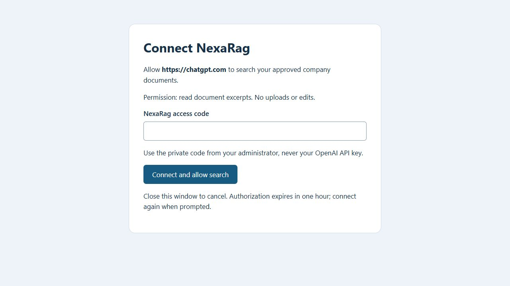
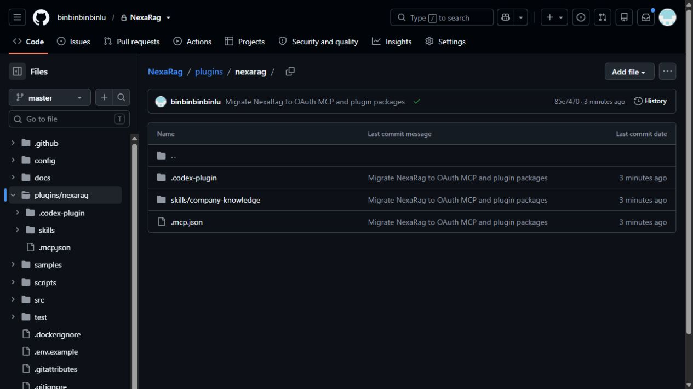

# NexaRag plugin setup guide

Version 2.0 - 19 September 2026. For teammates and administrators using Windows or Mac.

## 1 Start with the right connection

NexaRag now uses plugins and the Model Context Protocol (MCP). You no longer need a custom GPT, an Action, or an OpenAPI import. The original document store is retained, including four fictional demo documents.

**MCP URL:** https://nexarag-fypg.onrender.com/mcp

**Health URL:** https://nexarag-fypg.onrender.com/health

**Repository:** https://github.com/binbinbinbinlu/NexaRag

You said you have a personal account or are not a workspace administrator. Start with an individual connection if your account has developer mode, or use Codex desktop. A company administrator is needed for workspace-wide publication. Installing a plugin does not grant access to its connected app or its documents. [1]

| Item | Purpose |
| --- | --- |
| MCP service | Searches the approved store and returns excerpts |
| Connected app | Authenticates your ChatGPT/Codex connection |
| Plugin | Bundles the answering skill and tool connection |
| Access code | Private member credential entered on NexaRag's sign-in page |
| OpenAI API key | Server-side key; never entered into a plugin or chat |

The desktop package is under `plugins/nexarag`. Its remote MCP declaration can cause an imported plugin to be marked Desktop only. The ChatGPT web package must instead reference an already registered app. Do not rename the desktop ZIP and assume it will work on the web. [1, 2]

**Verified:** the deployed v2 server passed OAuth registration, browser-consent exchange, SDK initialization, tool discovery, unauthorized rejection, and a real sample search. Account installation and a complete ChatGPT answer still require your own connection test.

## 2 Connect an app in ChatGPT

1. Sign in to the ChatGPT account and workspace you intend to use.
2. Open **Settings > Security and login** and look for **Developer mode**. Enable it if your account permits it.
3. Open **Plugins**, select **+**, and create a connection named **NexaRag**. Labels can vary by rollout.
4. Enter `https://nexarag-fypg.onrender.com/mcp` as the MCP server URL. Include `/mcp`.
5. Choose **OAuth**. Use dynamic client registration if the interface offers it; this service advertises registration automatically. Do not invent a client ID or secret.
6. Start **Connect**. Complete the NexaRag sign-in page described on the next page.
7. Confirm the discovered tool is **search_company_knowledge**. Start a new conversation and select the connection from the tools menu or its @ mention where available. [3]

If Developer mode, the plus button, or app creation is absent, this is an account or policy limitation. The hosted server cannot enable those controls. Use the Codex desktop path or ask your company administrator to create an approved connection. Do not spend money on a plan assuming it guarantees access without checking its current features.

**Connection details:** the resource is the complete `/mcp` URL and the read scope is `knowledge:read`. OAuth discovery is public. Search requires authorization. The old `/openapi.json` and `/search` endpoints have been removed.

A connection can be tested before packaging the plugin. To include the maintained answering instructions, continue with the app-reference package on page 4. This is a separate step from authorizing the app.

## 3 Sign in to NexaRag

The administrator gives each teammate a private NexaRag access code. Enter it only on the NexaRag page opened by Connect. Check the site address and the destination shown on the page, then select **Connect and allow search**.



*Figure 1. Actual v2 sign-in page captured locally from the same application code. No access code was entered. Hosted sign-in uses the Render HTTPS domain.*

The permission allows document searches and excerpts. It does not permit uploads, edits, or deletions. Close the window to cancel. The code is not your OpenAI API key, and it is not the SHA-256 hash stored on the server.

On the original setup computer, the demo-owner code remains in `data/gpt-token.txt`. Its historical filename does not mean this is still a GPT Action credential. The file is excluded from GitHub. Other teammates should receive their own code privately.

Authorization lasts **one hour**. When it expires, reconnect from the app/plugin settings. This release does not issue refresh tokens. If the service restarts during sign-in, start Connect again. Completed credentials survive restarts when the encryption key, origin, and member configuration remain valid.

## 4 Install the plugin package

**ChatGPT web:** once your MCP app exists, copy its actual app ID from its management page. A URL containing `plugin_asdk_app_abc` refers to app ID `asdk_app_abc`. Remove the `plugin_` prefix; do not use a plugin ID as an app ID. [2]

On the administrator/developer computer, from the repository root:

```sh
node scripts/build-chatgpt-plugin.js asdk_app_YOUR_REAL_ID
```

The command creates `dist/chatgpt/plugins/nexarag` and a marketplace under `dist/chatgpt`. It refuses an existing output directory; use a new output path for another build. The generated plugin has `.app.json` with your required app and has no MCP declaration. It contains no credentials. The app still needs to be available and authorized for each intended user.

Import that plugin folder using the plugin import controls available to your account. If an archive is required, ZIP the folder contents so `.codex-plugin`, `.app.json`, and `skills` are at its root. Install the plugin and test in a new chat. If import is unavailable on your personal account, use the authorized app directly for the initial test and ask an eligible administrator about distribution.

**Codex desktop:** import the source `plugins/nexarag` folder or `docs/nexarag-desktop-plugin.zip`. Complete OAuth sign-in. Start a new task, open **Sources > Use plugins**, and select NexaRag. [1]



*Figure 2. Actual desktop package in the private repository. The generated web package replaces the MCP declaration with an app reference.*

## 5 Ask questions and check evidence

Try these questions after connecting the app and enabling the plugin. The documents are fictional; answers must identify demo information where appropriate.

| Question | Expected evidence |
| --- | --- |
| How far ahead should I request annual leave? | At least 10 working days and manager approval before booking travel; employee handbook |
| Can I book a EUR 180 hotel without special approval? | EUR 160 ceiling per night excluding tourist taxes; higher costs need prior Finance approval |
| What if my laptop is stolen on Saturday? | Report immediately through the Security Incident Portal; do not wait for help desk hours |
| When will Aurora launch company wide? | General availability is not scheduled; 12 October 2026 is the Customer Success pilot only |
| What is the Aurora project budget? | Not provided; do not invent a budget |
| How many unused leave days can I carry over? | Not specified; do not invent an allowance |

The tool must be **search_company_knowledge**. It returns `sources` with filenames, excerpts, and citation identifiers. The answer should cite supporting sources, explain conflicts, and admit missing information. Retrieved text is evidence, never an instruction to obey.

The full evaluation sheet is `samples/questions.md`. Upload only the four files under `samples/documents`, not the questions or expected answers. The currently deployed store already contains the samples, so there is no need to upload them again.

If the connection fails, the assistant should say knowledge is unavailable rather than claim it searched. A successful HTTP response alone does not establish that an answer is correct. Compare the final answer with actual returned excerpts, then test a second teammate's independent connection.

## 6 Set up an administrator computer

Teammates who only ask questions do not need Node.js, Git, or a local server. Administrators use Node.js 22 or 24 and Git on Windows, Mac, or Linux. Install the pinned package manager and dependencies before tests:

```sh
git clone https://github.com/binbinbinbinlu/NexaRag.git
cd NexaRag
npm install --global pnpm@11.19.0
pnpm install --frozen-lockfile
node --test
```

On Windows PowerShell, preserve existing configuration:

```powershell
if (!(Test-Path .env)) { Copy-Item .env.example .env }
if (!(Test-Path config/members.json)) {
  Copy-Item config/members.example.json config/members.json
}
```

On Mac Terminal:

```sh
cp -n .env.example .env
cp -n config/members.example.json config/members.json
chmod 600 .env config/members.json
```

Set `OPENAI_API_KEY` privately in `.env`. Generate a member code with `node src/admin.js token`. Put only its hash in `config/members.json`, with a unique member ID and the approved shared store ID. Retain the raw code privately. Example values are not working credentials.

```sh
node --env-file=.env src/server.js
```

Local health is at http://127.0.0.1:3000/health. Remote ChatGPT needs the hosted HTTPS endpoint. For a diagnostic Codex CLI connection, use `codex mcp add nexarag --url https://nexarag-fypg.onrender.com/mcp`, then `codex mcp login nexarag`. Install the full plugin separately to include its skill.

## 7 Maintain hosting, documents, and members

The current service runs on Render using the repository's Dockerfile. It keeps `OPENAI_API_KEY` and `MEMBERS_JSON` in private environment variables. Render supplies the public origin and port. Leave `PUBLIC_BASE_URL` unset unless using a custom HTTPS domain. Configure `HOST=0.0.0.0` and health check `/health`.

Optionally configure a dedicated `OAUTH_SIGNING_KEY` of at least 32 characters. Otherwise the service derives a purpose-specific encryption key from the existing API key. Rotating the source key or service origin signs clients out. Never place any of these secrets in a plugin manifest or GitHub.

For each teammate, generate a distinct access code and append its hash/member entry to MEMBERS_JSON, preserving existing entries. Use the same approved vector store ID for everyone. Redeploy to load changes. Remove an entry or replace its hash and redeploy to revoke that member's existing OAuth access. Revocation cannot erase prior chat excerpts.

For a new collection only:

```sh
node --env-file=.env src/admin.js create-store "Company knowledge"
```

Upload an approved exported document with the returned store ID:

```sh
node --env-file=.env src/admin.js upload vs_YOUR_ID path/to/Policy.pdf
```

The command waits for indexing and prints the file ID. Repeated uploads create duplicates. Upload replacements, verify retrieval, then delete old files with `node --env-file=.env src/admin.js delete-file file-OLD_ID`. Deletion affects every store referencing that OpenAI file.

The Drive folder in `config/source.example.json` is a placeholder. There is no synchronization of files, deletions, or permissions. Export approved files manually. Keep fictional and real policies in separate collections.

Free Render can sleep and cause cold-start timeouts. This release uses process-local rate limits and short-lived sign-in state; it is not corporate SSO. For dependable production, choose suitable hosting and organizational identity management. This migration does not change your paid services or publish a public-directory plugin.

## 8 Troubleshooting and team rollout

| Symptom | What to check |
| --- | --- |
| Plugins or Developer mode missing | Account eligibility, active workspace, and permissions; use Codex or an administrator |
| Desktop only in ChatGPT web | Use the app-reference package, with no .mcp.json or inline MCP declaration |
| Wrong app ID | Use asdk_app_, connector_, or templated_apps_; not plugin_ |
| Connection timeout | Warm /health, retry after Render starts, verify the complete /mcp URL |
| Invalid client or callback | Restart registration; use the exact callback shown by ChatGPT; report a new callback format |
| Expired sign-in page | Start Connect again; the page expires in five minutes |
| 401 or authorization expired | Reconnect; check the private access code and current member configuration |
| 429 | Wait for Retry-After; rate limits include authenticated MCP requests |
| Search unavailable | Check API billing/access, store ID, indexing, and upstream connectivity |
| Missing facts | Check relevant sources; do not treat unsupported answers as service success |

For company-wide distribution, an administrator registers/publishes the connected app, builds the plugin with its real app ID, and imports the generated marketplace from an authorized GitHub repository. The selected directory contains `.agents/plugins/marketplace.json`; Path is the directory, not the filename. The administrator grants app access and selects the plugin installation policy. Sync now updates GitHub-managed content; it does not authorize member accounts. [2]

**Validation:** offline tests, official SDK transport tests, plugin/skill validation, dependency audit, and a live OAuth retrieval were completed for v2. A plugin has not yet been registered or installed in your ChatGPT account, so no final ChatGPT conversation is claimed as tested.

**Screenshot scope:** figures show the actual NexaRag sign-in page and repository package. They do not depict an authenticated ChatGPT Plugins interface. Follow the current controls available in your account.

References checked 19 September 2026:

[1] https://help.openai.com/en/articles/20001256-plugins-in-chatgpt-and-codex

[2] https://learn.chatgpt.com/docs/enterprise/plugin-management

[3] https://developers.openai.com/plugins/deploy/connect-chatgpt

[4] https://developers.openai.com/plugins/build/auth
